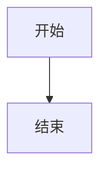

# 论文图表索引

## 一、最小单元用例图

| 编号 | 文件 | 说明 |
|------|------|------|
| 图3.1 | `01-uc-login.mmd` | UC1-用户登录 |
| 图3.2 | `02-uc-register.mmd` | UC2-用户注册 |
| 图3.3 | `03-uc-logout.mmd` | UC3-用户登出 |
| 图3.4 | `04-uc-send-message.mmd` | UC4-发送消息 |
| 图3.5 | `05-uc-view-history.mmd` | UC5-查看历史 |
| 图3.6 | `06-uc-create-session.mmd` | UC6-创建会话 |
| 图3.7 | `07-uc-diagnosis.mmd` | UC7-症状诊断 |
| 图3.8 | `08-uc-search-disease.mmd` | UC8-疾病查询 |
| 图3.9 | `09-uc-search-drug.mmd` | UC9-药物查询 |
| 图3.10 | `10-uc-emergency.mmd` | UC10-紧急识别 |

## 二、功能模块用例图

| 编号 | 文件 | 说明 |
|------|------|------|
| 图4.1 | `11-module-auth.mmd` | 模块1-认证模块 |
| 图4.2 | `12-module-chat.mmd` | 模块2-聊天会话模块 |
| 图4.3 | `13-module-diagnosis.mmd` | 模块3-智能诊断模块 |
| 图4.4 | `14-module-knowledge.mmd` | 模块4-知识查询模块 |

## 三、系统总体用例图

| 编号 | 文件 | 说明 |
|------|------|------|
| 图5.1 | `15-system-use-case.mmd` | 系统总体用例图 |

## 四、流程图

| 编号 | 文件 | 说明 |
|------|------|------|
| 图6.1 | `21-flow-login.mmd` | 登录流程 |
| 图6.2 | `22-flow-chat.mmd` | 聊天主流程 |
| 图6.3 | `23-flow-diagnosis.mmd` | 诊断详细流程 |
| 图6.4 | `24-flow-agent.mmd` | Agent决策流程 |
| 图6.5 | `25-flow-sse.mmd` | SSE流式响应流程 |

## 使用方法

所有图表使用 Mermaid.js 语法，可在以下工具中渲染：

1. **VS Code** - 安装 "Markdown Preview Mermaid Support" 插件
2. **在线** - 访问 https://mermaid.live/
3. **Typora** - 直接预览 .mmd 文件

## 引用示例

```markdown
如图3.1所示，用户登录用例包含输入账号、验证凭证、生成Token等步骤。
```



---
*最后更新: 2026-03-13*